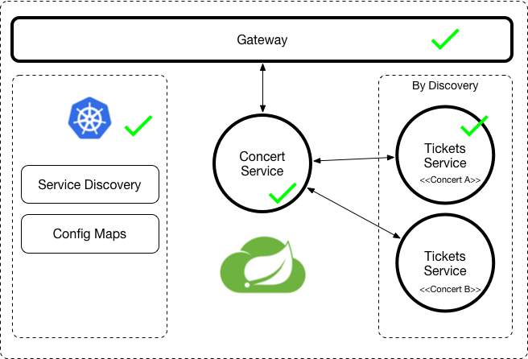

# SpringOne Platform 2018 :: Spring Cloud on PKS (Kubernetes)

This document goes over the features covered in [this presentation]()
The following repositories were deployed into an instance of PKS (Pivotal (K)Container Services), but the same application be deployed to other Kubernetes installations. 

- [s1p_gateway](https://github.com/salaboy/s1p_gateway)
- [s1p_concerts-service](https://github.com/salaboy/s1p_concerts-service)
- [s1p_tickets-service](https://github.com/salaboy/s1p_tickets-service)
- [Spring Boot Admin with K8s Support](https://github.com/salaboy/showcase-admin-tool)

In order to deploy each service into PKS, we used [Jenkins X](http://jenkinsx.io), but you can use any other tools that you fancy to deploy these projects. 

# Scenario

  
We have 3 simple components that are deployed into the Kubernetes Cluster. These components will use Spring Cloud features to do service discovery and configurations. 

We will start by having a Spring Cloud Gateway that will automatically register routes based on Discovered Services. Notice that now, the service registration is done by Kubernetes, so all Kubernetes Services will be available to the DiscoveryClient. To filter some of the results, we can use labels, to configure the Discovery Client to filter only the services which contains a certain set of labels (conditions). 

Then we have the main Concerts Service, which is backed up by MongoDB to store basic information about each concert. The concert information doesn't have any tickets related information and that is delegated to specific "Tickets" services for each concert. In that way you should be able to scale the tickets handling if there is high demand for one of the concerts. 

By default, when you get the concerts list, no tickets information will be fetched. When you request a special concert, if a tickets service exist for the concert it will decorate the concert information by calling the corresponding Tickets Service. 

As in any microservice implementation, there are no strong dependencies between services, meaning that you can deploy services in any order and they will be used when available. 

# Spring Cloud Kubernetes pointers

Some important pointers to Spring Cloud Kubernetes features that are being used
- [Dependencies used in Gateway](https://github.com/salaboy/s1p_gateway/blob/master/pom.xml#L62)
- [Configuration used in Gateway](https://github.com/salaboy/s1p_gateway/blob/master/src/main/resources/application.yml#L15)
- [Security Related Aspects: ServiceAccount & Role & Role Bindings](https://github.com/salaboy/s1p_gateway/tree/master/charts/s1p-gateway/templates)
- [Using Configuration coming from Config Maps 1](https://github.com/salaboy/s1p_concerts-service/blob/master/src/main/java/org/sp1/demo/concerts/service/services/ConcertServiceImpl.java#L51)
- [Using Discovery Client to find Services based on metadata and business logic](https://github.com/salaboy/s1p_concerts-service/blob/master/src/main/java/org/sp1/demo/concerts/service/services/ConcertServiceImpl.java#L95)
- [Discovery Client labels filtering](https://github.com/salaboy/s1p_concerts-service/blob/master/src/main/resources/application.properties#L6)
- [Using Configuration coming from Config Maps 2](https://github.com/salaboy/s1p_concerts-service/blob/master/src/main/java/org/sp1/demo/concerts/service/config/ConcertsConfiguration.java)
- [Using Configuration coming from Config Maps 3](https://github.com/salaboy/s1p_concerts-service/blob/master/src/main/resources/bootstrap.properties#L2)

# Deploy yourself

- Configure your kubernetes cluster to get access using kubectl
- Install Jenkins X [Getting Started](https://jenkins-x.io/getting-started/). Notice that you need to install the CLI and JX services in your Kubernetes cluster.
- Fork [s1p_gateway](https://github.com/salaboy/s1p_gateway)
  - jx import (inside the cloned directory)
  - Wait for the pipeline to deploy the Spring Cloud Gateway
- Fork [s1p_concerts-service](https://github.com/salaboy/s1p_concerts-service)
  - jx import (inside the cloned directory)
- Fork [s1p_tickets-service](https://github.com/salaboy/s1p_tickets-service)
  - jx import (inside the cloned directory)
   
   
 # Questions / Contact
 Feel free to jump into our gitter channel for questions about this example, or create issues here. 
   
